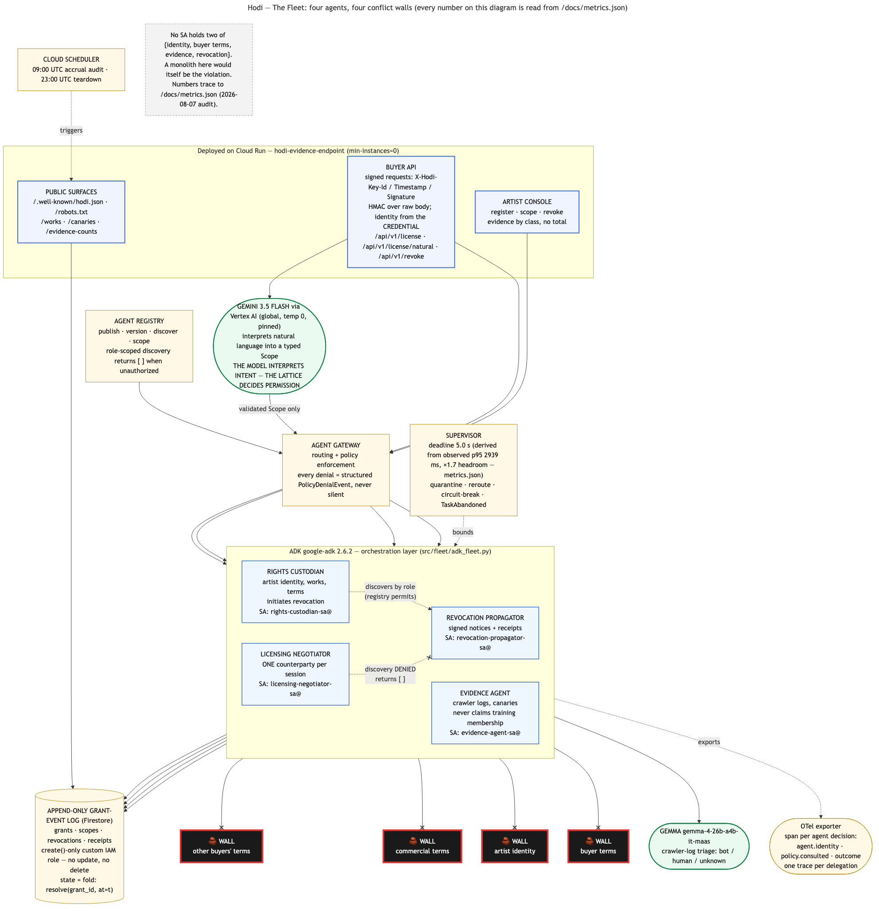
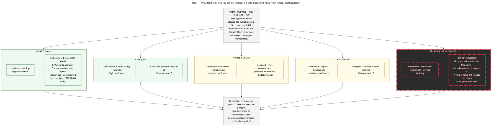

# Hodi — Creative Consent Administration Fleet

[](https://github.com/Jeremiah-Sakuda/Hodi/actions/workflows/verify.yml)

*"Your voice is in a product you never agreed to."*

Hodi is a governed fleet of institutional agents that administers creative consent end to end: registering works with proof of control, expressing scoped machine-readable terms, negotiating with buyers under confidentiality, and propagating revocations across affected grants. The fleet's four agents are separated by conflict of interest — not by task — and every inter-agent call passes a policy-enforcing gateway whose denials are logged as structured events, never silent. Hodi's audit record refuses to assert anything it cannot verify, structurally: the schema itself cannot express the claims the system will not make.

**Hodi is the knock.**

---

## The honesty invariants — enforced by structure, not prose

This table is lifted verbatim from the PRD (§3.4). Every enforcement mechanism is checkable in this repo.

| Invariant | Enforcement mechanism (checkable in this repo) |
|---|---|
| No agent can read another buyer's terms | Per-agent service accounts + gateway policy; the negotiator's SA is scoped to one `counterparty_id` per session, and that session id comes from a verified request credential, never from the request body. Negative-test matrix asserts `PERMISSION_DENIED` on cross-buyer reads, and an attack suite replays the real exploit that broke this in production. |
| No verdict about training-set membership can exist | The `class` enum has no such value; the schema cannot express it. Every `EvidenceRecord` carries a literal `claim_limit` string. A render-time lint rejects an enumerated list of overclaim phrases — "trained on", "was in the training set", "proves training" and others — in any generated text. |
| Evidence classes never aggregate | No numeric field on `EvidenceRecord`; no summing, scoring, or ordering across classes anywhere; the renderer groups by class and refuses a total. |
| Grants are never mutated | Append-only `create()`-only event log with deterministic IDs; revocation is a **new event that supersedes**; the original grant remains visible with a strikethrough, never deleted. |
| Current state is always a fold | `resolve(grant_id, at=t)` is the single read path; "what was permitted on March 3" is the same fold, dated. |
| Ownership is verified or explicitly not | `control_tier` is mandatory; `verified_control` requires a stored `control_proof`; the UI renders the three tiers differently and never hides `asserted`. |
| Untrusted documents cannot redirect the fleet | Prompt Inspector (local regex) on post-extraction bytes of every inbound buyer/scope document; detection emits an event and an anomaly item and the request **proceeds** under its original scope. |
| A looping or hallucinating worker cannot stall the fleet | Supervisor with per-agent deadline and circuit breaker; quarantine + reroute; `TaskAbandoned` events; every decision carries an OTel span. |
| Least privilege | One SA per agent, per the conflict boundaries below; no SA holds two of {identity, buyer terms, evidence, revocation}, and the consent arbiter holds none of them. |
| No agent can claim beyond its epistemic authority | Per-role assertion authority declared as data ([assertion_authority.py](src/schema/assertion_authority.py)), enforced at the gateway; the training-membership claim has no assertion class, so it cannot be submitted as data. |
| An abandoned worker cannot commit after quarantine | Execution leases: the supervisor revokes the lease at the deadline, and the gateway checks it immediately before every supervised write, so a woken worker can compute but not commit. |
| A signed artifact can be verified without Hodi | Asymmetric signing (Cloud KMS live, labelled-ephemeral offline); `hodi verify` and `/verification-key` check receipts and incident manifests against a public key Hodi could never mint with. |
| A caller cannot assert a role it does not hold | The gateway binds service account to role from `iam_policy.py` on every call; the OIDC path derives the role from a Google-signed token's verified email, so it cannot be chosen; `HODI_REQUIRE_VERIFIED_IDENTITY=1` refuses unverified in-process identities outright. |
| Unreachable storage is an outage, not an empty log | Gateway and event store both raise unless the run declared `HODI_OFFLINE=1` — no path serves process-local data as if it were the append-only log. |
| A deployment claim cannot outlive its evidence | Deployment state lives in `docs/deployment_status.json`; a `verified` capability must name its evidence *and* its date, and `make check-docs` guards the prose bidirectionally — a disclaimer is required while unverified and forbidden once verified. |

---

## Architecture



*Source: [diagram_a_the_fleet.mmd](docs/architecture/diagram_a_the_fleet.mmd). Every number traces to [docs/metrics.json](docs/metrics.json).*



*Source: [diagram_b_what_hodi_will_not_say.mmd](docs/architecture/diagram_b_what_hodi_will_not_say.mmd).*

---

## Why four agents: the conflict-of-interest topology

The separation is a **conflict of interest**, not a division of labour:

- The **rights custodian** holds artist identity and must see it.
- The **licensing negotiator** talks to buyers and must **not** see other buyers' negotiated terms — rate confidentiality is the norm and a leak destroys the next deal. Its service account is scoped to one `counterparty_id` per session.
- The **evidence agent** reads access logs and outputs and must **not** see commercial terms, or its findings become interested.
- The **revocation propagator** acts across grants and must not hold identity.

A single agent would need the union of all four permission sets — precisely the position no honest broker may occupy. **A monolith here would itself be the violation.**

A **fifth agent, the consent arbiter**, joins them for incident adjudication (see *Autonomous consent incident response* below). It holds **none** of the four conflict domains — no identity, no buyer terms, no raw evidence, no revocation authority, and no write path to grant history — because an adjudicator that could also be a witness would be an interested one. Extending the topology rather than bending it: no service account holds two of {identity, buyer terms, evidence, revocation}, and the arbiter holds zero.

The full permission matrix is in [docs/architecture/conflict_matrix.md](docs/architecture/conflict_matrix.md). That document is **GENERATED** from [src/schema/iam_policy.py](src/schema/iam_policy.py) by [scripts/generate_conflict_matrix.py](scripts/generate_conflict_matrix.py), so the documentation cannot drift from the enforced bindings — the doc and the gateway consult the same data. **Who may *claim* what** is declared the same way, in [src/schema/assertion_authority.py](src/schema/assertion_authority.py): zero trust applied to epistemic authority, enforced at the same gateway with the same structured denials.

---

## Quickstart

Requires Python 3.11+ and `make`.

```bash
pip install -r src/evidence_service/requirements.lock
make demo
```

**Zero credentials, no network, no emulator.** Verified from a clean clone of this repository in a fresh `python:3.11-slim` container with no mounted config. Runs entirely from committed fixtures and proves, with assertions that fail the run if false: the scope-lattice partial order (declared as data); byte-stable replay of `resolve()` over a shuffled event log; revocation narrowing the present without rewriting the past; the poisoned buyer document detected and proceeding under its original scope with an identical licensable outcome; all four conflict walls denying forbidden reads with structured `PolicyDenialEvent`s; and the schema refusing to express training-set membership.

```bash
make demo-live
```

Proves the cross-buyer boundary against the **deployed** service in two independent places. Part A exercises the gateway policy layer: a properly scoped read that succeeds with real grant documents, an unfiltered read that is denied, and a cross-counterparty read that is denied, each returned and logged as the same structured event. Part B exercises the **production request path**, replaying the unauthenticated cross-buyer exploit that worked on 2026-08-07 and asserting it is now refused. Part C replays anonymous calls against the mutating and internal routes (`/api/v1/revoke`, `/internal/accrual_audit`). Public endpoint, no credentials; wall-clock time is printed (about 2 seconds warm).

```bash
make verify-scopes
```

Prints the lattice table from its declaration as data and runs the 56-case containment truth table across all five gating dimensions simultaneously (use-type, model class, commercial status, territory, temporal validity), including empty-territory semantics, union-across-grants cases, the fold-before-containment cases (a revoked grant's original event in the append-only log must never permit a request), and the request-window containment cases (a grant valid through September, asked in August for rights through December, answers no — currency is not containment).

```bash
make verify-manifest
```

Fetches the **live** `/works` manifest and verifies the corpus-integrity properties: the 5-work registered corpus is served, every `verified_control` work has a stored proof whose URI resolves with HTTP 200, and every work carries its canary string and plant date.

```bash
make test
```

Runs the full offline suite — 458 tests, credential-free, including the cross-buyer attack suite, the work-scoped authorization adversarial suite, the route-authentication coverage guard, the recording-script contract guard, the 56-case containment truth table, the ADK delegation, and the quarantine drill. Twelve tests that genuinely require live Firestore or live IAM (byte-identity at rest, and reading the deployed runtime identity back from IAM, cannot be proven against an in-memory buffer) are skipped unless you set `HODI_E2E=1`, because they write to real collections.

```bash
make compliance
```

Extracts every requirement ID from the PRD and diffs §4 against the §2 compliance matrix **and the prose**; fails on any orphan or range notation. Verifies 74 requirements as of this writing. Also runs `check-docs`, which fails if any accrual figure in the README, Diagram B, or the submission text disagrees with `docs/metrics.json`.

```bash
make buyer-client
```

Runs a **buyer-side** system against Hodi: it reads the published terms, requests a licence, **verifies the receipt with Hodi's public key alone**, gates its own use on that verification, and then — after the artist revokes — **stops**, recording why in its own audit trail. Hodi terminating a grant in its own log is administration; a counterparty halting because the rail told it to is the product.

```bash
make deployment-status
```

Renders the generated *What is actually deployed* table, and `--check` validates its rules.

```bash
make red-team
```

Runs the six-attack red-team drill (see *Autonomous consent incident response*): an injected instruction, a compromised negotiator, a compromised evidence agent, a rogue worker committing after quarantine, and a tampered incident package. Every boundary that yields exits nonzero, and the legitimate transaction completes at the end. Credential-free and offline.

**All of the above run in CI** on every push and pull request ([.github/workflows/verify.yml](.github/workflows/verify.yml)) — the offline suite, the demo, the red-team drill, the buyer client, the truth table, compliance, deployment-status validation, doc-drift, and lint coverage. Nothing in CI needs credentials or the deployed service; the four targets that do (`demo-live`, `verify-manifest`, `metrics`, and the `HODI_E2E` tests) are deliberately excluded and named in the workflow so their absence is a decision, not an oversight.

---

## Reproducing the demo, beat by beat

| On-camera moment | Command |
|---|---|
| The author's registered works, terms attached, control tiers rendered distinctly | `curl https://hodi-evidence-endpoint-406699565497.us-central1.run.app/works` (or `make verify-manifest`) |
| Machine-readable consent terms at a well-known URI | `curl https://hodi-evidence-endpoint-406699565497.us-central1.run.app/.well-known/hodi.json` |
| The four conflict walls denying forbidden reads, with structured denial events | `make demo` (Beat 5, in-process) and `make demo-live` (deployed path) |
| Agent-to-agent delegation across three service accounts, addressed by role-scoped registry discovery | `make demo` (Beat 5B — real ADK runner, one OTel trace) |
| A looping worker is quarantined and deregistered; the request still completes as a stated partial result | `make demo` (Beat 5C) — deployed path: `POST /api/v1/fleet/delegation_drill` (artist-credentialed) |
| Live buyer scope request; Prompt Inspector catches the poisoned document; request proceeds under original scope | `make demo` (Beat 4, fixture path) — live path: `POST /api/v1/license` with [fixtures/buyer_request_poisoned.json](fixtures/buyer_request_poisoned.json) |
| Natural-language request → Gemini structures a typed Scope → the lattice decides | `make demo` (Beat 4B, replaying the recorded model response) — live path: `POST /api/v1/license/natural` |
| Revocation narrows the present, never the past; all events remain visible | `make demo` (Beat 3) — live cascade: `POST /api/v1/revoke` |
| OTel span per agent decision, carrying agent identity, policy consulted, outcome | `make demo` (Beat 5B emits one trace across the delegation); the HOD-020 harness is `python3 src/harness/main.py` (exits 1 by design, recording the Antigravity result) |
| The honesty beat: what Hodi will not say | `make demo` (Beat 6) and Diagram B in [docs/architecture/](docs/architecture/) |
| Autonomous consent incident: observe → adjudicate → contain → prove, with a signed manifest that verifies from its own bytes | `make demo` (Beat 7) and `make red-team` |

---

## What Hodi will not claim

- **Training-set membership is not determinable, and Hodi cannot say it.** Membership inference against frontier models is an unsolved problem. The guarantee is **structural**: the `EvidenceRecord.class` enum has no such value, so the schema cannot express the claim as data, and every record carries the literal `"This record does not assert training-set membership."` A render-time lint additionally rejects overclaim phrasings in free text, in two layers, and we measure it rather than assert it: against a probe set of 12 paraphrases it was deliberately not written against, **it rejects 12** — **4** by the deterministic regex list and **8** more by an embedding backstop ([`src/evidence/semantic_backstop.py`](src/evidence/semantic_backstop.py), `gemini-embedding-001`, pinned) that compares candidate text to plain-language anchors (`overclaim_lint_coverage` in [docs/metrics.json](docs/metrics.json), regenerated by `make lint-coverage`). **Both figures are published because the second depends on a model:** if the embedding surface is unreachable or the offline cache lacks a vector, the backstop disables itself and coverage falls back to 4. The backstop is admissible precisely because it can only ever ADD a refusal — it runs after every regex has already declined to reject, so a wrong embedding yields a false refusal (Hodi emits the deterministic template instead of a drafted notice), never a false permission; `tests/test_semantic_backstop.py` asserts that monotonicity, and asserts that negated phrasings like *"this revocation does not un-train the model"* — which every drafted notice is required to contain — are not refused. **The schema remains the invariant**: the lint reduces the chance of a bad sentence and nothing more.
- **Revocation terminates a grant. It does not un-train a model.** Revocation is a legal instrument with technical enforcement of the grant, a dated notice, and a receipt (whose `signature` field is verifiable or labelled-unverifiable depending on the deployment — see below). A lint asserts that no generated notice implies removal from a model.
- **`crawler_access` is instrumented, and exactly one crawler has been observed.** The evidence endpoint has logged every access since Aug 6, 2026. As of the **2026-08-13** audit ([docs/metrics.json](docs/metrics.json), regenerated by `make metrics`): **1613 accrued records, of which 1 matches a crawler user-agent signature.** That one record is the finding: a self-identifying crawler fetched **`/robots.txt` on 2026-08-11 — and did not fetch [`/.well-known/hodi.json`](https://hodi-evidence-endpoint-406699565497.us-central1.run.app/.well-known/hodi.json), where the machine-readable consent terms live.** 1572 records are this project's own instrumented tooling. The remaining 41 are non-self-originated but browser-like and are reported as *unattributed*, not as crawler access. `known_crawler_ua_matches` is the only figure this project will call crawler access. **This number was 0 until 2026-08-12, and it was wrong:** the detector's pattern required a word boundary *before* `bot`, so the commonest crawler-naming convention — a vendor prefix glued straight onto `bot` — never matched. The corrected claim is narrower and more interesting than the null result it replaces: *the terms are published, discoverable, and reachable in one request from the file the crawler did read — and it did not ask.* `make check-docs` fails the build if these numbers drift from `metrics.json`.
- **Access records are attributable, not authenticated.** A `crawler_access` record captures the user agent a client chose to send and the peer address Cloud Run's front end reports. User agents are self-declared and can be set to anything; the client-supplied portion of `X-Forwarded-For` is ignored in favour of the hop the front end appends, which narrows source-address forgery without eliminating it. Hodi therefore treats these records as evidence of *a request having been made*, never as proof of *who made it*.
- **The agent identities are enforced at three altitudes, and the remaining application-layer piece is named.** (1) *Append-only* — grant history cannot be rewritten — is runtime IAM: the service executes as a create-only identity (`hodi-runtime-sa`, no `datastore.entities.update`/`.delete` in its effective permissions), verified live by [`tests/test_grant_log_iam.py`](tests/test_grant_log_iam.py). (2) *The domain boundary is a credential boundary* — executed 2026-08-14: each conflict domain has its own named Firestore database (`hodi-identity`, `hodi-commercial`, `hodi-evidence`, `hodi-adjudication`; the grant log stays in `(default)`), and each agent SA's grants are IAM-**conditioned** to its own domain's database plus the grant log — the evidence SA attempting to read the identity database is refused by **Google IAM**, before any application code runs, proven live by [`tests/test_workload_identity.py`](tests/test_workload_identity.py) via SA impersonation ([scripts/setup_workload_identity.sh](scripts/setup_workload_identity.sh)). The first execution of that script FAILED its own proof — the agent SAs' unconditional append-only bindings spanned every database, so conditions narrowed nothing until the broad grants were replaced; the script now does that, and `deploy_gcp.sh` carries a guard so a later provisioning run cannot silently un-harden it. (3) *The revocation worker runs as its own workload identity* — executed 2026-08-14: a separate Cloud Run service (`hodi-revocation-worker`) under `revocation-propagator-sa@`, private (`--no-allow-unauthenticated`; anonymous 403, authenticated 200), its effective permissions verified append+read with no update/delete ([scripts/deploy_revocation_worker.sh](scripts/deploy_revocation_worker.sh)). **What remains application-layer, stated plainly:** the main service is still one process serving the custodian/negotiator/evidence/arbiter roles, and live collections still reside in `(default)` — so row-level separation inside the grant log remains gateway-enforced until data migrates into the named databases. See [docs/FINDINGS.md](docs/FINDINGS.md).
- **Revocation terminates exactly the grants that permit the revoked use.** Revoking use type R terminates every active grant whose held type *permits* R — the same `permits()` predicate the licensing path uses. Revoking `training` terminates a `training` grant; it does **not** touch a `fine_tuning`-only grant, because that grant never permitted training. [`tests/test_revocation_reach.py`](tests/test_revocation_reach.py) asserts all 25 (held × revoked) cells against `permits()` as an independent oracle. *This was wrong until 2026-08-12 — the selection was inverted (it terminated the revoked type's descendants, so revoking `training` destroyed narrower licenses the artist never revoked), and, worse, an earlier test and findings entry had blessed that behaviour as correct; both are retracted.* One disclosed limit remains: terminating a grant held *above* R removes the whole grant — revoking `fine_tuning` on a `training` grant strips `training` too — because a single-valued `use_type` on a chain cannot express "training but not fine_tuning." That is a scope-model limit, and terminating is the safe direction. See [docs/FINDINGS.md](docs/FINDINGS.md).
- **An artist can only revoke a work they own.** `/api/v1/revoke` authenticates an artist credential *and* checks, via a rights-custodian read of `works`, that the authenticated artist owns the `work_id` — before anything is delegated or appended. Authenticating the principal without the ownership check let any valid artist credential revoke any published work; a missing or differently-owned work is now a uniform 403. The propagator cannot read `works` by policy, so this gate lives at the API layer, which is where the conflict topology puts ownership.
- **A `signature` field is either verifiable or says it proves nothing — and which one you get depends on the deployment, so read the field.** Three states, never conflated, all produced by [`src/schema/signing.py`](src/schema/signing.py) and reported live at [`/verification-key`](https://hodi-evidence-endpoint-406699565497.us-central1.run.app/verification-key):
  1. `KMS-ECDSA-P256-SHA256:<key>:<sig>` — real asymmetric signing, private key never leaving Cloud KMS, verifiable by anyone holding the public key and mintable by no one else. **Executed 2026-08-14**: keyring `hodi-signing` / key `hodi-provenance`, with `roles/cloudkms.signer` bound to the runtime SA alone, and [scripts/deploy.sh](scripts/deploy.sh) fails the deploy unless [`/verification-key`](https://hodi-evidence-endpoint-406699565497.us-central1.run.app/verification-key) then serves the public key — a signature nobody can fetch the key for is decoration. `docs/deployment_status.json` is the machine-readable source, and `make check-docs` fails if this paragraph disagrees with it.
  2. `ED25519-EPHEMERAL:<key>:<sig>` — a real signature under a key generated at process start and dead at process end. `make demo` uses it so the sign → verify → tamper-detect mechanism is demonstrable with zero credentials. The alg tag says `EPHEMERAL` out loud precisely so it can never be read as production provenance.
  3. `UNSIGNED_PLACEHOLDER:<kind>:<id>` — what every path emits when no signer is configured. It is a labelled non-signature: nothing verifies it, because there is nothing to verify. Documents written before signing existed still carry it, and cannot be rewritten.

  Documents written before 2026-08-12 still read `SIG_REVOKED` and cannot be rewritten — append-only, and the runtime identity holds no `update` or `delete` — so a dump can show all four vintages side by side. That mixture is the append-only guarantee working, not a partial migration. The one thing we did **not** do is HMAC: a shared secret makes a notice verifiable only by parties who could equally forge it, which over a legal artifact is worse than an honest placeholder. [`tests/test_signature_honesty.py`](tests/test_signature_honesty.py) fails if any path emits a signature-looking value nothing can verify, and [`scripts/hodi_verify.py`](scripts/hodi_verify.py) verifies a receipt or an incident package from its own bytes plus a public key — no Hodi service, no credentials.

  *This bullet said "it has not been built" for one commit after it was built — an external review caught it. The fix is not just this prose: signing state is now derived from `docs/deployment_status.json` under `make check-docs`, so the claim cannot silently outlive the code again.*
- **`verbatim_match` and `redistribution` are checked but undemonstrated against a third party.** The check is real and deterministic: [`src/evidence/verbatim_probe.py`](src/evidence/verbatim_probe.py) requires a contiguous run of at least 12 normalized tokens of a **registered passage** ([fixtures/work_passages.json](fixtures/work_passages.json)) to appear in the observed text, and `redistribution` requires either the planted canary or such a run in the content served at the mirror URI. A paraphrase produces **no record**, and a work with no registered passage produces **no record**. This is deliberately not a model: *verbatim* means exact, and an embedding measures similarity — routing this through a model would let a paraphrase mint a record typed `verbatim_match`. **Correction, 2026-08-14:** until this date this bullet claimed "the checking code exists" and it did not. `process_verbatim_match` accepted `prompt` and `generated_output`, read neither, and emitted a record unconditionally; `process_redistribution` took no content parameter at all, so it could not have verified anything even in principle — and the test asserted a record *was* produced for output sharing nothing with any work, blessing the stamp. Nothing in production called either method, so no such record was ever minted on the live service. What is still not claimed: no third-party model has been observed reproducing a registered passage, and a match would establish co-occurrence of text — never training-set membership, which the schema cannot express.

Stated plainly, without apology: these are the limits of what is checkable, and the product's value is that it stops exactly there.

---

## Autonomous consent incident response

The impressive flow is `request → interpret → authorize → grant/revoke`. The flagship is the harder one: **observe → investigate → adjudicate → contain → prove** — a potential consent violation detected, investigated by mutually constrained agents, contained, and recorded in a cryptographically verifiable manifest, *without any single agent holding enough authority to manufacture the conclusion*. Run it: `make demo` (Beat 7).

- **Assertion authority — zero trust applied to what an agent may *claim*, not just what it may read.** Alongside the collection policy, [src/schema/assertion_authority.py](src/schema/assertion_authority.py) declares which role may submit which typed assertion class, enforced at the gateway. The evidence agent may assert `OBSERVED_HTTP_ACCESS`; it may **not** assert that a grant existed (that is the negotiator's epistemic position) — and it structurally **cannot** assert model training, because `MODEL_TRAINED_ON_WORK` is not an assertion class. The same construction as `EvidenceRecord.class`: the unsayable is inexpressible as data, before any authority check runs.
- **The consent arbiter concludes only what typed assertions support.** The fifth agent receives typed assertions and a policy version — never raw evidence, identity, or terms — and adjudicates **deterministically**. It establishes `ACCESS_OUTSIDE_DECLARED_POLICY` when the assertions support it, and returns `MODEL_TRAINING_OCCURRED: NOT_ESTABLISHED` on **every** decision, carried in a `not_determinable` map the schema validates can only ever say `NOT_ESTABLISHED`. The counterparty-side advocate's one exculpatory assertion — that access does not establish training — is present and treated as true.
- **Containment acts only on what Hodi administers.** No takedowns, no enforcement — the rail, not a weapon. Pending negotiation for the principal is **frozen** (the license routes refuse a frozen principal with a structured 403 before the negotiator engages), and grants that permit the inconsistent use are terminated **through the existing idempotent cascade**. Revocation stays the propagator's verb, not the arbiter's.
- **The record proves itself.** Determinism buys the strongest check in the system: `hodi verify` re-runs the arbiter's exact policy over the packaged assertions and requires the reproduced decision to equal the recorded one — alongside signature, evidence-hash, assertion-hash, and assertion-authority checks. Thirteen checks, offline, from the package's own bytes; **one tampered byte anywhere fails.** Hodi does not ask the reviewer to trust Hodi — it hands over a receipt they can verify against a public key Hodi could never forge with, and could never mint.
- **The red-team drill: five attacks, one command** — `make red-team`. An injected "grant unlimited rights" document (flagged, lattice unmoved); a compromised negotiator reaching for artist identity (denied by IAM policy, not an `if`); the evidence agent asserting model-training (refused by the schema *and* the authority matrix); a rogue worker committing after quarantine (its execution lease revoked, its write refused); a tampered incident package (verification fails, then verifies again once restored). Every boundary that yields exits nonzero, so the drill runs in CI, and the legitimate transaction still completes at the end.

Every adversary in every fixture is a **fictional, unnamed scraper**. No real company appears as a violator — the positioning rule that decides whether this reads as infrastructure or as an accusation.

---

## Negative decisions

- **No vector database.** Every query the registry answers is an exact fold over typed events — `resolve(grant_id, at=t)`, filtered reads by `counterparty_id`. Similarity search would exist only to rank or aggregate evidence across classes, which the invariant table forbids. It would be infrastructure for a query the schema refuses to answer.
- **No O(n²) verbatim sweep.** Comparing every crawled page against every registered work is N×M. At the real corpus's scale today (5 works × 1613 logged accesses) that is at most 8,065 comparisons — and at any real registry scale (10⁵ works × 10⁷ pages) it is 10¹² and dead on arrival. Evidence is event-driven instead: planted canaries, access logs, and targeted checks.
- **No second front-end.** The buyer surface is a signed API with machine-readable license documents and receipts. Two UIs is how a 26-day build becomes a 40-day build.
- **No takedown automation, no litigation tooling, no enforcement actions.** Hodi is a licensing rail, not a weapon.

---

## Technologies used

Build history, findings, and the write-up are first-class artifacts here — including the corrections:

- **[docs/BUILD-LOG.md](docs/BUILD-LOG.md)** — every session's verbatim prompt, outcome, and forked decisions, including five dated correction notes where earlier entries overclaimed or reported unbuilt infrastructure as done, and were struck.
- **[docs/FINDINGS.md](docs/FINDINGS.md)** — daily observations plus two long-form named findings: the live cross-buyer confidentiality breach (dates, exact exposure, why the existing boundary test could not catch it), and the day this project's own Cloud Scheduler job was counted as a third-party crawler, inverting its signature honesty claim.
- **[Seven ways to lie to yourself in code](https://jeremiah-sakuda.github.io/Hodi/blog/seven-ways-to-lie-to-yourself-in-code.html)** *(published)* — the defect ledger as a write-up: thirty-six defects, nine classes, the four that recurred, the meta-pattern behind all of them, and the four structural guards that answer it. Source: [docs/blog/](docs/blog/seven-ways-to-lie-to-yourself-in-code.md).
- **[docs/social-posts.md](docs/social-posts.md)** — the launch posts.
- **[docs/architecture/conflict_matrix.md](docs/architecture/conflict_matrix.md)** — generated from the policy module the Gateway reads.

- **ADK (Google Agent Development Kit), `google-adk==2.6.2`** — the runtime agent framework, and it executes: [src/fleet/adk_fleet.py](src/fleet/adk_fleet.py) defines the fleet as real `google.adk.agents.BaseAgent` subclasses and drives them through a real `google.adk.runners.Runner`. One delegation crosses three distinct service accounts — negotiator → (registry discovery denied) → rights custodian → (registry discovery granted) → revocation propagator — and the ADK event stream is what the caller consumes. The agents extend `BaseAgent` rather than `LlmAgent` deliberately: each hop is a deterministic authority decision, and putting a model in that path would be the opposite of this project's thesis. Run it with `make demo` (Beat 5B). Chosen by the pre-committed branch documented in [docs/antigravity/decision.md](docs/antigravity/decision.md).
- **OpenTelemetry** — every agent decision emits a span carrying `agent.identity`, `policy.consulted`, and `outcome`, nested inside ADK's own `invoke_agent` spans, so a whole delegation reads as a single trace.
- **Gemini 3.5 Flash via Vertex AI** (`gemini-3.5-flash`, `global` endpoint, temperature 0) — natural-language scope interpretation in the buyer API (`POST /api/v1/license/natural`): **the model interprets intent, the lattice decides permission.** Gemini's only power is to produce a schema-validated `Scope`; a malformed, out-of-vocabulary, or extra-field interpretation is rejected (HTTP 422), never coerced, and `permits()` remains the sole authority — a test asserts the model's output cannot influence the permission decision except by producing a valid Scope. Gemini also drafts revocation notices, gated by the deterministic `RevocationLint` with a linted template fallback. Why this exact model: availability was probed empirically on Aug 7, 2026 ([docs/FINDINGS.md](docs/FINDINGS.md)) — `gemini-3.5-flash` is the newest stable, non-preview ID this project can reach (`gemini-3.5-pro` is absent from the publisher catalog and 404s everywhere; pro-class 3.x IDs are all previews, which roll, and judging runs to Oct 1). IDs are pinned as exact literals with a committed response cache ([fixtures/gemini_response_cache.json](fixtures/gemini_response_cache.json)) so `make demo` replays real recorded responses with zero credentials.
- **Gemma, serverless on Vertex AI** (`gemma-4-26b-a4b-it-maas`, pinned) — first-pass triage of crawler access records (bot / human / unknown) before anything reaches Gemini, running in the scheduled daily accrual audit. Deliberately non-load-bearing: if Gemma is unreachable, Ollama and then a heuristic classify, and evidence records are still produced.
- **Firestore** — the append-only grant-event log. Deterministic event IDs, `create()`-only discipline, custom IAM role withholding `update`/`delete` from every agent SA. State is always a fold over events. The durable registry and Memory Bank fold over the same store; per-domain named databases are the workload-identity-separation target ([scripts/setup_workload_identity.sh](scripts/setup_workload_identity.sh), designed and scripted, not yet executed).
- **Cloud KMS** — asymmetric signing (ECDSA P-256/SHA-256) of receipts, notices, and incident manifests on the deployed path; the private key never leaves KMS and only the runtime identity holds `cloudkms.signer`. Provisioned and proven by [scripts/setup_kms_signing.sh](scripts/setup_kms_signing.sh); the credential-free demo uses an in-process **labelled-ephemeral** Ed25519 key so the sign-verify-tamper mechanism is demonstrable offline. Verify with `hodi verify` against `/verification-key`.
- **Cloud Run** — the deployed evidence endpoint and buyer API (services), and the headless verification harness plus nightly teardown (jobs). `min-instances=0`, max capped. The revocation worker splits into its own service under the propagator SA ([scripts/deploy_revocation_worker.sh](scripts/deploy_revocation_worker.sh), designed and scripted, not yet executed) — real workload identity, and the killable isolation the in-process daemon thread cannot provide.
- **Cloud Scheduler** — two jobs with visible execution history: `hodi-daily-accrual-audit` (09:00 UTC, runs the crawler-access audit with Gemma triage and persists it to `accrual_audits`) and `hodi-nightly-teardown-trigger` (23:00 UTC, executes the Gemma-project teardown Cloud Run Job, whose no-op paths are empirically verified).
- **Cloud Logging** — gateway policy denials land as structured `jsonPayload` events (severity WARNING), queryable by calling SA, collection, and policy — the same event object the API returns.

---

## Building on the Antigravity SDK

The Antigravity SDK was verified against a pre-committed boolean assertion, quoted here from [docs/antigravity/decision.md](docs/antigravity/decision.md):

> *From a headless Cloud Run Job, with no interactive session, the SDK executes a two-agent delegation under distinct service accounts and emits an OpenTelemetry span per agent decision carrying (a) the invoking agent's identity, (b) the policy consulted, and (c) the outcome.*

**Observed result (verbatim in the decision document):** the headless Cloud Run Job `hodi-antigravity-harness-2l2ql`, running under distinct SAs (`agent-delegator@…`, `agent-worker@…`), failed the assertion at the first check: `No module named 'google.antigravity'`. Antigravity does not currently expose a headless server-side Python surface for multi-agent delegation under distinct GCP service accounts. Partial emission had been pre-committed as a fail, so the branch executed the same day: runtime agent execution moved to **ADK + the OpenTelemetry SDK**, whose spans carry all three required attributes (full span payloads are in the decision document).

This is a finding about the SDK's current headless surface, published rather than buried: a negative result with the exact harness, error text, and span payloads a toolchain owner would need to reproduce it.

---

## Provenance

- **First commit:** `76392260f65c4e253d82db530a36d456cc0768ce` at `2026-08-06T12:37:20-05:00` (`2026-08-06T17:37:20Z`).
- **Public, unsquashed history** at [github.com/Jeremiah-Sakuda/Hodi](https://github.com/Jeremiah-Sakuda/Hodi) from the first commit onward. All code was authored inside the submission period.
- **Relationship to my other submissions:** there is no shared lineage to disclose in this direction — **Hodi was built first.** The claim-record, append-only event-log, and provenance patterns originate in this repository; no code was copied into it from any other submission. Any later submission of mine that reuses this spine will disclose the direction of the copy (from Hodi, with paths and dates). The evidence is the public unsquashed history from the first commit onward.

---

## Security & data integrity

- **Buyer requests are authenticated, and identity comes from the credential.** Each counterparty holds a shared secret registered under a `key_id`; requests carry `X-Hodi-Key-Id`, `X-Hodi-Timestamp`, and an `X-Hodi-Signature` HMAC-SHA256 over the raw request body, checked inside a 300-second freshness window. The `counterparty_id` used for every read, filter, session context, and receipt is the one bound to the verified credential — a `counterparty_id` in the request body is only ever compared, never trusted, and a mismatch is refused and logged as a structured denial event. **This is a fix, not a design note:** until 2026-08-07 the API took `counterparty_id` from the body and used it as both the query filter and the session context the gateway checked that filter against, so an anonymous caller could read another counterparty's grants. The attack suite in [tests/test_buyer_api_auth.py](tests/test_buyer_api_auth.py) replays that exploit and its variants, `make demo-live` replays it against the deployed service, and the incident is recorded in [docs/BUILD-LOG.md](docs/BUILD-LOG.md).
- **Prompt inspection is a deterministic first-pass injection indicator, local and labelled as such.** The managed Model Armor guardrail could not be used: the API is in restricted preview and template creation returned HTTP 403 for this project. The claim was pulled rather than shipped under a Google product's name. Prompt inspection is a local regex over an enumerated pattern list, labelled `local_regex_inspector` everywhere it appears — in code, in API responses, and in the evidence counts endpoint. It is **not** a general prompt-injection defense: a semantic paraphrase ("disregard everything that preceded this") can evade the literal patterns, and that is expected of a first-pass indicator. The load-bearing guarantee is not that the regex catches everything — it is that **detection can never widen the licensable set**, because the lattice decides permission and the document text is never an input to it. The request proceeds under its original scope whether or not the inspector fires.
- **The security posture rests on IAM boundaries, gateway policy enforcement, and audit traces.** Four service accounts, no SA holding two conflict domains, a custom Firestore role that cannot update or delete grant events, and a gateway that converts every policy violation into a structured, logged `PolicyDenialEvent`.
- **`/api/v1/debug/compromised_agent_read` is a public endpoint on purpose.** It simulates a compromised licensing negotiator attempting three reads: one properly scoped to its own session counterparty (which succeeds, returning that counterparty's grants — data the negotiator is entitled to), one unfiltered, and one cross-counterparty. The last two are structurally guaranteed denials: the gateway consults the same policy data as production traffic, so the endpoint can only produce denial events plus the one read the caller was always allowed. It exists so a reviewer can verify the cross-buyer confidentiality boundary over the public network in under a minute, without credentials. Run it: `make demo-live`.

---

## Published writing

- **Blog — [Seven ways to lie to yourself in code](https://jeremiah-sakuda.github.io/Hodi/blog/seven-ways-to-lie-to-yourself-in-code.html)**. The defect ledger: thirty-six defects across nine classes, the four that recurred, the Antigravity SDK assertion that was verified before it was made, and the four structural guards. Created for the All Things Agentic Hackathon.
- **Project site — [https://jeremiah-sakuda.github.io/Hodi/](https://jeremiah-sakuda.github.io/Hodi/)**, serving the build log, findings, the Antigravity decision, and the generated IAM matrix.
- **Social posts** — tagged `#AllThingsAgenticHackathon`. Text in [docs/social-posts.md](docs/social-posts.md).
  - LinkedIn: <!-- POSTED-URL-1 --> *(not yet posted)*
  - X: <!-- POSTED-URL-2 --> *(not yet posted)*

---

## What is actually deployed

Every "is it deployed" claim below is **generated** from [docs/deployment_status.json](docs/deployment_status.json) by [scripts/deployment_status.py](scripts/deployment_status.py), and `make check-docs` fails the build if the prose disagrees with it. This exists because it drifted once: the README told readers asymmetric signing "has not been built" for a commit after it was built, and an external reviewer found it. A deployment claim is a claim, so it is derived from its evidence rather than remembered.

<!-- GENERATED by scripts/deployment_status.py from docs/deployment_status.json.
     Do not hand-edit: `make check-docs` compares the docs against that file. -->

| Capability | State | Evidence | Last verified (UTC) |
|---|---|---|---|
| `evidence_endpoint` | ✓ verified | https://github.com/Jeremiah-Sakuda/Hodi/actions/runs/31827960181 | 2026-08-14T18:18:54Z |
| `append_only_runtime_identity` | ✓ verified | https://github.com/Jeremiah-Sakuda/Hodi/actions/runs/31827960181 | 2026-08-14T18:18:54Z |
| `cross_buyer_boundary_over_network` | ✓ verified | https://github.com/Jeremiah-Sakuda/Hodi/actions/runs/31827960181 | 2026-08-14T18:18:54Z |
| `gemini_scope_interpretation` | ✓ verified | docs/metrics.json :: natural_language_license_path (deployed-over-network timings) | 2026-08-07T18:43:00Z |
| `conflict_domain_separation` | ▣ in-process only | HODI_E2E=1 tests.test_workload_identity (live IAM denial, 7/7); tests.test_identity_binding + tests.test_caller_identity (offline); make demo-live (deployed, over the network) | 2026-08-14T17:00:00Z |
| `kms_signing` | ✓ verified | https://github.com/Jeremiah-Sakuda/Hodi/actions/runs/31827960181 | 2026-08-14T18:18:54Z |
| `per_domain_databases` | ✓ verified | https://github.com/Jeremiah-Sakuda/Hodi/actions/runs/31827960181 | 2026-08-14T18:18:54Z |
| `split_revocation_worker` | ✓ verified | scripts/deploy_revocation_worker.sh (executed 2026-08-14; proves the deployed identity, permissions and invocation before reporting success) | 2026-08-14T00:00:00Z |
| `durable_trace_backend` | ○ scripted, never run | src/observability/tracing.py + tests/test_tracing_backend.py (offline) | — |
| `live_release_verification` | ✓ verified | https://github.com/Jeremiah-Sakuda/Hodi/actions/runs/31827960181 | 2026-08-14T18:18:54Z |
| `scheduled_jobs` | ✓ verified | Cloud Logging: resource.type=cloud_scheduler_job, job_id=hodi-daily-accrual-audit, AttemptFinished 2026-08-14T09:00:58Z 'Original HTTP response code number = 200'; docs/metrics.json :: daily_crawler_accrual_metrics (rows persisted by that job); Google-Cloud-Scheduler appears in distinct_user_agents | 2026-08-14T17:20:00Z |

`○ scripted, never run` means exactly that: the script is in this repository and reproducible, and it has not been executed against the live project. `▣ in-process only` means the boundary is enforced by application code inside one Cloud Run process — real and tested, but not a cloud-infrastructure boundary.

The validator refuses the file itself if a capability is marked `verified` without naming both the evidence and the date, or if something `scripted, never run` carries a verification date. All three failure modes are mutation-tested.

---

## Live services

- Evidence endpoint: `https://hodi-evidence-endpoint-406699565497.us-central1.run.app`
- Consent terms: [`/.well-known/hodi.json`](https://hodi-evidence-endpoint-406699565497.us-central1.run.app/.well-known/hodi.json)
- Registered works manifest: [`/works`](https://hodi-evidence-endpoint-406699565497.us-central1.run.app/works) — 1 work at `verified_control` with a resolving proof; 4 at `asserted`, two of which are demonstration registrations whose canonical URIs do not currently resolve
- Canaries index: [`/canaries`](https://hodi-evidence-endpoint-406699565497.us-central1.run.app/canaries)
- Evidence counts by class (no totals, by design): [`/evidence-counts`](https://hodi-evidence-endpoint-406699565497.us-central1.run.app/evidence-counts)
- Artist console: [`/console/`](https://hodi-evidence-endpoint-406699565497.us-central1.run.app/console/) — **read-only.** It renders the registered works, their control tiers, and evidence grouped by class with no total. Its revoke control is a local preview and sends no request: revocation requires an artist-principal credential, and a static SPA cannot hold that secret without shipping it to every visitor.

Authenticated routes (`/api/v1/license`, `/api/v1/license/natural`, `/api/v1/revoke`) require signed-request headers; `/internal/accrual_audit` requires the Cloud Scheduler service account's OIDC token. Revocation additionally requires an **artist** credential — a buyer credential is refused.

Deployed-path timings (measurement surface: `deployed-over-network`, from [docs/metrics.json](docs/metrics.json), re-measured 2026-08-14 on revision `hodi-evidence-endpoint-00045-dkz`): buyer API license path 712 ms warm average when permitted and 455 ms when denied; revocation cascade 2263 ms cold / 737 ms warm average; natural-language license path 3518 ms warm average (each request includes one server-side Gemini call); failure-tolerance drill — a looping worker detected, quarantined and rerouted — 1114 ms server-side average against a 1.0 s supervisor deadline, i.e. detection plus recovery costs about 110 ms on top of the deadline it is waiting on; supervisor deadline in production 5.0 s, derived from an observed p95 of 2939 ms with 1.7× headroom.

**Two of those figures got slower, and the reason is the point.** The cascade went from ~534 ms to ~737 ms when it gained an execution lease and an idempotency outbox, so a retry cannot double-issue a revocation notice and an abandoned worker cannot commit late. The permitted license path went from ~399 ms to ~712 ms because its receipt is now signed by Cloud KMS instead of stamped with a placeholder. The denied path is *faster* than the permitted one for the same reason inverted: a denial issues no receipt, so it signs nothing. These are published as regressions rather than absorbed, because a latency number that only ever improves is a number someone is managing.

### Failure tolerance (HOD-341, HOD-342)

`QuarantineEngine` and the circuit breaker are on the executed delegation path, not beside it. Force the propagator into a loop and the Supervisor abandons it at its deadline — writing `TaskAbandoned` itself, since the worker is still looping and has reported nothing — the Registry deregisters it for the remainder of the run, and the task reroutes to a standby that returns a **stated** partial result: the affected grant set computed from the lattice and the folded state, with **no notices issued and no events appended**, because the quarantined worker's write state is unknown and the log is append-only. Quarantine and reroute are both spans in the same trace as the delegation.
